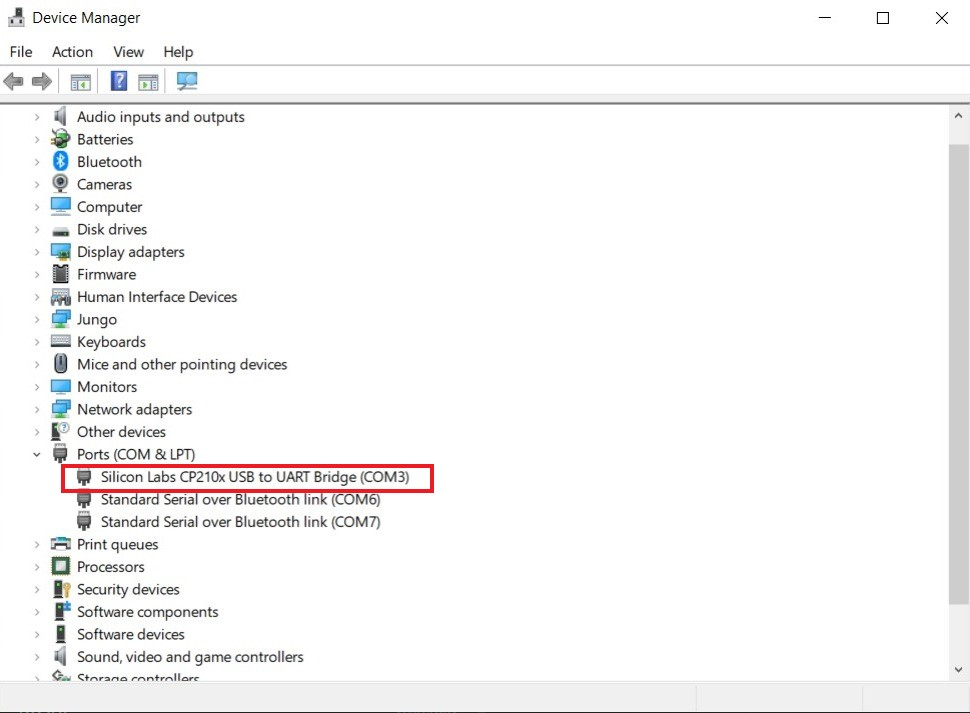
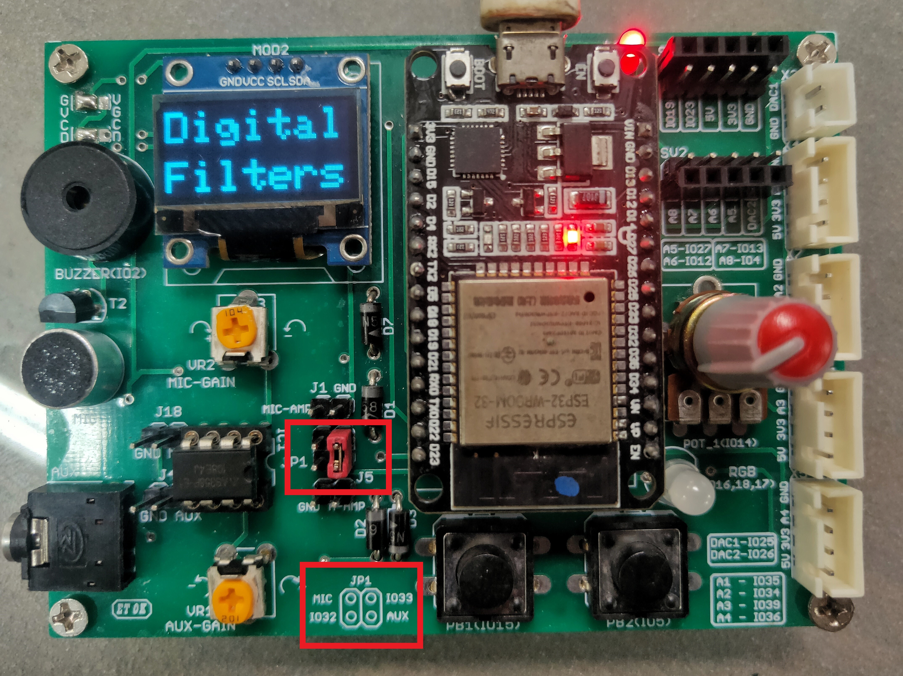
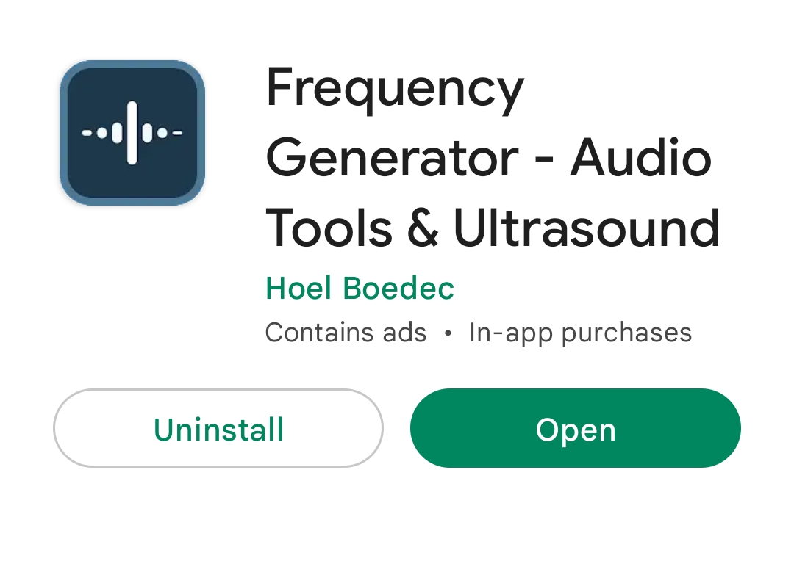
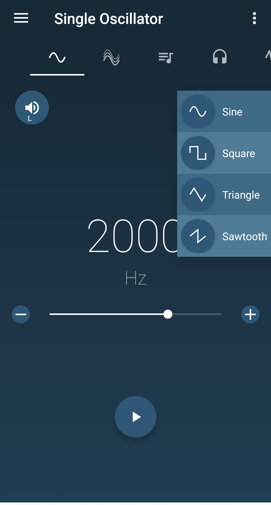
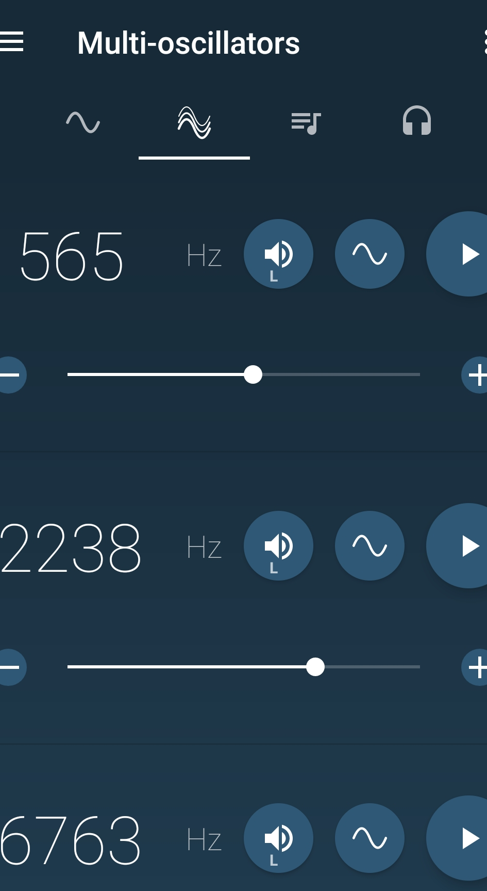
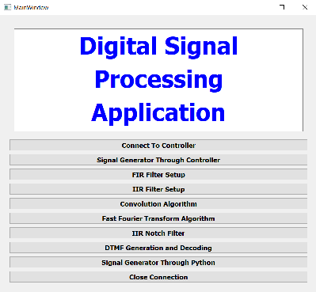

# GETTING STARTED WITH DSPshaala

## INTRODUCTION

### Salient Features of the Kit

1. High-performance ESP32 processor operating at 240Mhz.
2. Inbuilt support of Bluetooth and wifi.
3. Hardware implementation of the digital signal processing algorithm.
4. Input and output sensors are available for use.
5. Dedicated OLED panel for displaying relevant information.
6. Extra ports are available for connecting further components with connectors.

### Python App Features

1. It provides a simple and convenient graphical user interface (GUI) consisting of several drop-down menus, sliders and value boxes to take input about all the parameters required for the algorithm to be implemented.
2. The python application apart from taking inputs for the parameters and sending that information to the controller can also plot input and output data points from the algorithm, eliminating the need for a digital storage oscilloscope (DSO).
3. The application developed has tried to cover all the basic fundamental DSP algorithms like the digital filters, convolution and FFT etc., under the same umbrella with separate modules that include the generation of signals.

### SETTING UP ARDUINO IDE(FOR ESP32) 

#### Downloading and Installing Arduino IDE

In order to download the Arduino IDE, [visit this link](https://www.arduino.cc/en/software), download and run the installation.

#### Installing ESP32 add-ons for Arduino IDE

In the Arduino IDE, go to File –> Preferences
Enter https://dl.espressif.com/dl/package_esp32_index.json into the “Additional Board Manager URLs” field.
Go to Tools –> Board –> Boards Manager. In the dialog box, that opens up, search for ESP32, and press install button for the “ESP32 by Espressif Systems version 1.0.3“.
**Use only 1.0.3 version to flash the code.**
Now, go to Tools –> Board. Now, select the ESP32 DEV Module.

#### Installing CP210x USB to UART Bridge VCP Drivers and Testing

For manual installation of driver, follow the following steps:

1. Download and install the driver from this link -> [Driver](https://www.silabs.com/developers/usb-to-uart-bridge-vcp-drivers?tab=downloads)

2. Once the driver is installed, connect the board with the laptop using micro-USB cable.

3. Next open the Device Manager, you can search for it in the Windows search box. You should see something similar in Device Manager if drivers are installed properly.
<

     

4. After this you can flash Blink program(File -> Examples -> Basics -> Blink) from Arduino IDE to test everything is working fine. To upload the code you need to select "ESP32 Dev Module" from Tools -> Board -> ESP32 Arduino. 

5. Then select COM port from "Tools -> Port -> *your COM port*

6. Then click on upload button and hold "**BOOT**" button on ESP32. Release the button as you see "**Connecting..**" message in the Arduino IDE. After that, you should see the “**Done uploading**” message.

7. If everything is working fine upto this, you can flash the DSPshaala code given in the repo.

## ADJUSTMENT AND SETTINGS

The input signal for processing can be received by the board from AUX connector or Microphone, circuitry for both are present on the board and there is no need to connect any external component.  
You can select the input source on board using the shorting jumpers as shown in the figure below.

     

The figure highlights the current setting on the **AUX** connector and also highlights the instructions on the board to select one. There is a support to give AUX and Microphone input to IO33 and IO32 ADC pins of the ESP32. By default only IO33 has been set in the code provided, which can be modified as per the use case.  
Also, two presets are given on the board to adjust the gain of the Microphone and AUX input. If you find your input signal clipped or too weak, you can adjust the gains by the presets, as highlighted in the figure below.

     

To give Sine/Square waves to the board as audio signal, you can use Frequency Generator app from Play Store on the smart phone.

     

     
     

## APP USAGE

The executable application currently supported on Windows OS can be downloaded with the repo.
<

     

1. **Serial Connection** – Setup the Serial connection with the python application with the controller to send various test-related information from Python Application. The input and output data from the algorithm from the controller are also provided by the controller through this serial connection.
Clicking the Connect To Controller would connect to an available device and clicking on Close Connection would close an existing connection.

2. **Signal Generator** – The connected controller can be used to provide a signal for DSP application. Click on the Signal Generator Through Controller button to enter this page of the application. Certain types of signals can be made available from the controller. The types of signals available are Sine, Square, Triangular, Sawtooth and Random wave. For selecting the type of signal, click on the drop-down Type Of Signal and select the required signal. The frequency of the signal can be set by the slider or can be written in the value box through the Frequency of Signal option which has a maximum value of 10000. The frequency can be incremented/decremented in small steps by clicking the small arrows of the value box. The signal generated would be available on the A/D converter present in the controller. The Set Output option would send the information about the above parameters in presence of a connected device. The Plot Output shows a visual representation of the type of signal available on the controller. The Back button on every page takes the application to the homepage.

3. **FIR Filter Implementation** – A finite impulse response (FIR) filter can be designed and visualised from this part of the project. Click on the FIR Filter Setup option to enter the FIR filter page. There are quite some options available to design any type of FIR filter with appropriate filter parameters. The Filter Response Type option can be chosen to select from the basic types of filter response namely Low Pass, High Pass, Band Pass and Band Stop. Next is the selection of the sampling frequency which could be selected from the Sampling Frequency option with the slider and value box similar to that as explained previously. The limit however here is 20000 samples/sec.
Next is the selection of the cut-off frequency of the passbands and stopbands of the filter to be designed. The individual frequency is to be selected the same way as mentioned to select the sampling frequency. The limit for each of the passband and stopband frequency is half of that of the selected sampling frequency according to the Nyquist Rate. The Fpb0 and Fsb0 are namely the passband and stopband frequency only applicable with lowpass and highpass types are selected as they require only one range of each passband and stopband. Carefully choose the values of Fpb0 and Fsb0 according to the chosen type as when a highpass filter is chosen then the value of Fsb0 should be smaller than the Fpb0. Similarly, the Fpb1, Fsb1, Fpb2, Fsb2 are used in the cases of bandpass and bandstop responses. After the selection of the cut-off frequency, now the passband and stopband ripple value is to be chosen from the Ap and As options. The Ap and As values are in decibels. After choosing all the options click on the Set Parameters option which would design the filter. A pop message with Filter Designed would appear otherwise there would be some error message. The filter order of the designed filter could be seen alongside the Order option. The Magnitude Spectrum of Filter option would plot the filter coefficients along with their magnitude response both in absolute values and in decibels. Clicking on Send Filter Coefficients would send these filter coefficients to the controller where the filter would be implemented. After the filter is implemented in the controller the input and output data from the controller can be plotted in the time domain and frequency domain by clicking the Input/Output Signal In Time Domain and FFT Of Input/Output Signal respectively.

     
     

4. **IIR Filter Implementation** - A infinite impulse response (IIR) filter can be designed and visualised from this part of the project. Click on the IIR Filter Setup option to enter the IIR filter page. Most of the options are similar to that of the FIR filter set up and follows the same rules and guidelines. One major difference the IIR filter setup has got the selection of the type of IIR Filter type which has the options as Butterworth, Chebyshev 1, Chebyshev 2 and Elliptical. Required IIR filter type can be chosen from the drop-down menu of IIR Filter Type. The rest of the functionality is similar to that of its FIR counterpart page menu.

     
     

5. **Convolution Algorithm** - Convolution is a process that takes in 2 data arrays and performs the algorithm resulting in another data array. Click on the Convolution option to enter the convolution setup page. There are mainly 3 setup options in the algorithm. First is the sampling frequency which can be selected with the Sampling Frequency option same way as explained previously. Next is the selection of no of signal to be convolved which can be selected from the No of Signals drop-down which has values 1 or 2. However, we always need 2 signals for this algorithm but selecting 1 would self-convolve the signal with itself. The last option is the selection of the size of array required for convolution which can be selected through the Size of the Input Array option having a slider and value-box combination same as that of sampling frequency but limited to a max size of 256. After the selection of these parameters clicking on the Start Convolution option would send the setup option to the controller in presence of a connected device and it would start the convolution process. The input data arrays and output convolved data from the controller can be plotted in the time domain and frequency domain by clicking the Input/Output Signal In Time Domain and FFT Of Input/Output Signal respectively.

6. **FFT Algorithm** - Fast Fourier Transform is an algorithm that takes any data array and provides an insight into the frequency components present in the data array. Click on the Fast Fourier Transform Algorithm option to enter the fft setup page.
There are 2 setup options to be selected for this algorithm, the sampling frequency and the size of the input array which can be selected from the Sampling Frequency and Size of Input Array options. Clicking on Start FFT would send these setup parameters to the comptroller and it would start the fft algorithm. The output of the fft algorithm can be plotted by clicking Plot FFT of Signal Button. 

7. **IIR Notch Filter** - IIR Notch filter is a 2nd order IIR filter that can eliminate a small band of frequency from any signal. Click on the IIR Notch Filter option to enter the notch filter setup page. The sampling frequency has to be selected from the Sampling Frequency option. Next, a single cut-off frequency has to be selected from the Cut-off Frequency option which has a max value of half the value that was selected sampling frequency according to the Nyquist Rate. This setup has an additional setup option known as the steepness value which accounts for how narrow would be the stopband of the filter. Its value ranges from 0.8 to 0.999(just less than 1) and can be selected from the Value of a(Steepness) option. The rest all the buttons function the same way as they did in the FIR or IIR filter setup.

8.	**DTMF Generation And Decoding** – DTMF stands for Dual Tone Multi-Frequency and in this, we have a set of buttons that can be decoded with the help of the sound. Click on the DTMF Generation And Decoding to enter the DTMF page. Here every clicking of every button produces a sound which has a mix of 2 sine frequency each from one of rows and one of the columns list of frequencies. The sound produced can be used to decode the frequency with the help of the Goertzel Algorithm. Every button produces a limited sound output on the laptop speaker. Clicking on Start Decoding would start the decoding on the controller and the decoded information can be displayed. 
<

     

`

9. **Signal Generator Through Python** - This is the last part of this application and it helps the user to generate different wave to provide input to the filter or other application. The signal is output on the laptop speaker or an aux cable can be connected to provide it to the controller. Click on the Signal Generator Through Python option to enter this page. There are a few options that have to be selected to generate the appropriate signal. First is the sampling frequency that can be selected from the Sampling Speed option having a maximum value of 100,000. Next is the selection of the time for which the sound/signal is produced and can be selected from the Time Period option having a maximum value of 20 sec. After that, 4 different separate signals can be enabled together. Every signal has its type that has options Sine, Square, Triangular, Sawtooth and Random which should be selected. Next is the selection of the required frequency of the signal which should be selected. If the Random type of signal is chosen then it didn’t require the selection of the frequency. Lastly for enabling signals each individual enabled button must be selected. Only the enabled signals would be selected for generating the output.
After selecting all the necessary options clicking on Set Output would play the output on the speaker. If the user wants to check the time domain and frequency response of the generated signal then the option Plot FFT Output can be clicked. Lastly is the generated signal have to be stopped while it is being played then the Stop Output options is to be clicked.

## REFERENCES

1. [Installing the ESP32 Board in Arduino IDE - Random Nerd Tutorials](https://randomnerdtutorials.com/installing-the-esp32-board-in-arduino-ide-windows-instructions/)